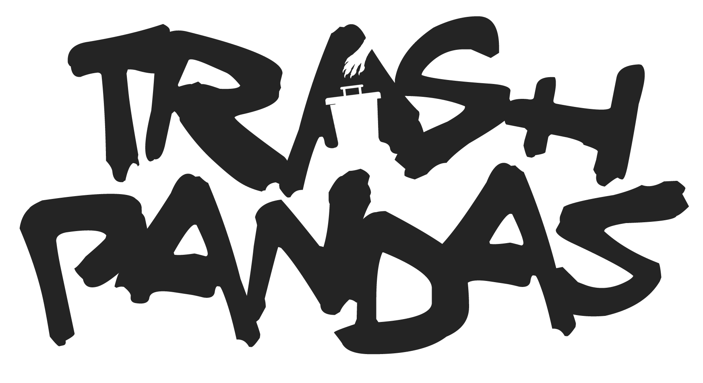

# Trash Panda Leftovers 🗑️🦝
Trash Panda Leftovers is a community built tool which shows you the probability of minting any of the 'leftover' [Degenerate Trash Panda](https://degentrashpandas.com/) in the collection that have yet to be minted.

---
# ToDo
- [ ] Automatically pull new mints from the blockchain
- [ ] Clean up code

---
# Deploy your own version
The entire app is open source, so you can deploy locally and it should just work. Follow these steps:

#### Install the dependencies: 📦
```
npm install
```

#### Compiles and hot-reloads for development 🧪
```
npm run serve
```

#### Compiles and minifies for production 🚀
```
npm run build
```

#### Lints and fixes files 💊
```
npm run lint
```
